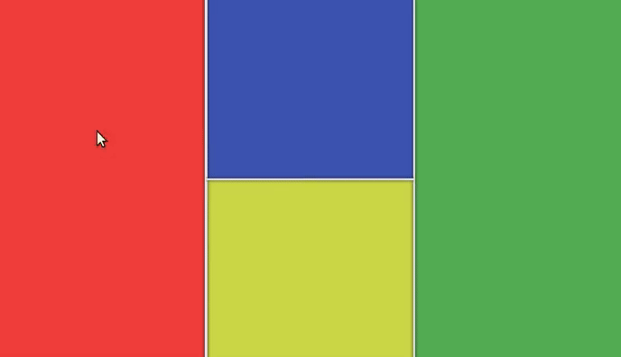

[](https://www.npmjs.com/package/split-me)
[](https://gitlab.com/ales.genova/split-me/pipelines)
[](https://www.webcomponents.org/element/split-me)
[![Built With Stencil](https://img.shields.io/badge/-Built%20With%20Stencil-16161d.svg?logo=data%3Aimage%2Fsvg%2Bxml%3Bbase64%2CPD94bWwgdmVyc2lvbj0iMS4wIiBlbmNvZGluZz0idXRmLTgiPz4KPCEtLSBHZW5lcmF0b3I6IEFkb2JlIElsbHVzdHJhdG9yIDE5LjIuMSwgU1ZHIEV4cG9ydCBQbHVnLUluIC4gU1ZHIFZlcnNpb246IDYuMDAgQnVpbGQgMCkgIC0tPgo8c3ZnIHZlcnNpb249IjEuMSIgaWQ9IkxheWVyXzEiIHhtbG5zPSJodHRwOi8vd3d3LnczLm9yZy8yMDAwL3N2ZyIgeG1sbnM6eGxpbms9Imh0dHA6Ly93d3cudzMub3JnLzE5OTkveGxpbmsiIHg9IjBweCIgeT0iMHB4IgoJIHZpZXdCb3g9IjAgMCA1MTIgNTEyIiBzdHlsZT0iZW5hYmxlLWJhY2tncm91bmQ6bmV3IDAgMCA1MTIgNTEyOyIgeG1sOnNwYWNlPSJwcmVzZXJ2ZSI%2BCjxzdHlsZSB0eXBlPSJ0ZXh0L2NzcyI%2BCgkuc3Qwe2ZpbGw6I0ZGRkZGRjt9Cjwvc3R5bGU%2BCjxwYXRoIGNsYXNzPSJzdDAiIGQ9Ik00MjQuNywzNzMuOWMwLDM3LjYtNTUuMSw2OC42LTkyLjcsNjguNkgxODAuNGMtMzcuOSwwLTkyLjctMzAuNy05Mi43LTY4LjZ2LTMuNmgzMzYuOVYzNzMuOXoiLz4KPHBhdGggY2xhc3M9InN0MCIgZD0iTTQyNC43LDI5Mi4xSDE4MC40Yy0zNy42LDAtOTIuNy0zMS05Mi43LTY4LjZ2LTMuNkgzMzJjMzcuNiwwLDkyLjcsMzEsOTIuNyw2OC42VjI5Mi4xeiIvPgo8cGF0aCBjbGFzcz0ic3QwIiBkPSJNNDI0LjcsMTQxLjdIODcuN3YtMy42YzAtMzcuNiw1NC44LTY4LjYsOTIuNy02OC42SDMzMmMzNy45LDAsOTIuNywzMC43LDkyLjcsNjguNlYxNDEuN3oiLz4KPC9zdmc%2BCg%3D%3D&colorA=16161d)](https://stenciljs.com)

# SplitMe - Universal Splitter

`SplitMe` is a universal splitter built with [Stencil](http://stenciljs.com). It can be embedded in projects using any framework or even plain HTML.

See a [Live Demo](https://alesgenova.github.io/split-me/).

<!--
```
<custom-element-demo>
  <template>
    <script src="../webcomponentsjs/webcomponents-lite.js"></script>
    <script src="https://unpkg.com/split-me/dist/split-me.js"></script>
    <style is="custom-style">
      .container {
        width: 100%;
        height: 15rem;
      }
      .fill {
        width: 100%;
        height: 100%;
      }
      .red {
        background-color: #f44336;
      }
      .green {
        background-color: #4CAF50;
      }
      .blue {
        background-color: #3F51B5;
      }
      .light-green {
        background-color: #CDDC39;
      }
    </style>
    <div class="container">
      <split-me n=3>
        <div slot="0" class="fill red"></div>
        <split-me slot="1" n=2 d="vertical">
          <div slot="0" class="fill blue"></div>
          <div slot="1" class="fill green"></div>
        </split-me>
        <div slot="2" class="fill light-green"></div>
      </split-me>
    </div>
  </template>
</custom-element-demo>
```
-->

[](https://alesgenova.github.io/split-me/)

## Table of Contents

- [Setup](#setup)
- [Basic Usage](#basic-usage)
- [Advanced Usage](#advanced-usage)
  - [Properties](#properties)
  - [Events](#events)
  - [Saving State](#saving-state)
- [Styling](#styling)

## Setup

### Option 1 (HTML)

Add the `SplitMe` script tag to your `index.html`:

```
<script src="https://unpkg.com/split-me/dist/split-me.js"></script>
```

### Option 2 (React / Angular / Vue)

Add `SplitMe` to your project:

```
npm install --save split-me
```

Import `SplitMe` in your `index.js`:

```js
import { defineCustomElements as defineSplitMe } from 'split-me/loader';

defineSplitMe(window);
```

## Basic Usage

Use the `split-me` tag anywhere you like. Set the number of slots in the splitter through the `n` attribute. Set the order the inner elements through the `slot` attribute:

```html
<split-me n="2">
  <div slot="0" class="fill red"></div>
  <div slot="1" class="fill green"></div>
</split-me>

<style>
  .fill {
    height: 100%;
    width: 100%;
  }
</style>
```

Splitters can be arbitrarily nested into each other to achieve any layout.

```html
<split-me n="3" sizes="0.3, 0.3, 0.4" min-sizes="0.2, 0.0, 0.0">
  <div slot="0" class="fill red"></div>
  <div slot="1" class="fill green"></div>
  <split-me slot="2" n="2" d="vertical" fixed>
    <div slot="0" class="fill blue"></div>
    <div slot="1" class="fill magenta"></div>
  </split-me>
</split-me>
```

## Advanced Usage

### Properties

| Property   | Attribute   | Description                                                                                             | Type                         |
| ---------- | ----------- | ------------------------------------------------------------------------------------------------------- | ---------------------------- |
| `d`        | `d`         | The direction of the splitter.                                                                          | `"horizontal" \| "vertical"` |
| `fixed`    | `fixed`     | Prevent the splitter from being resized.                                                                | `boolean`                    |
| `maxSizes` | `max-sizes` | The maximum sizes of the slots. Same format as `sizes`                                                  | `number[] \| string`         |
| `minSizes` | `min-sizes` | The minimum sizes of the slots. Same format as `sizes`                                                  | `number[] \| string`         |
| `n`        | `n`         | The number of slots in the splitter.                                                                    | `number`                     |
| `sizes`    | `sizes`     | The initial sizes of the slots. Acceptable formats are: `sizes="0.33, 0.67"` or `sizes="50%, 25%, 25%"` | `number[] \| string`         |
| `throttle` | `throttle`  | The minimum time (in ms) between resize events while dragging.                                          | `number`                     |

### Events

| Event         | Detail       | Description                                            |
| ------------- | ------------ | ------------------------------------------------------ |
| `slotResized` | IResizeEvent | Emitted every time dragging causes the slots to resize |

```typescript
interface IResizeEvent {
  sizes: number[]; // [0.25, 0.75]
  divider: number; // internal divider index
  originalEvent: MouseEvent | TouchEvent; // event that triggered resize
}
```

#### Saving State

```javascript
function handle(event) {
  // extrapolate details
  const { sizes, divider, originalEvent } = event.detail;
  const sourceElement = event.target;

  console.log(sourceElement, originalEvent);
  console.dir({ divider, sizes });

  // store state
  localStorage.setItem('split-sizes', sizes);
}

const el = document.querySelector('split-me');

// loads sizes, but only if they have not been set yet.
el.sizes = el.sizes || localStorage.getItem('split-sizes');

// listen on changes
el.addEventListener('slotResized', handle);
```

## Styling

`SplitMe` exposes a few CSS variables that can be overridden in order to adjust the styling of the dividers (gutters) to your liking.

This is the list of variables and their default values:

```css
:host {
  --divider-length: 100%; /* Length of the divider along the principal axis */
  --divider-thickness: 0.15rem; /* Thickness of the divider */
  --divider-color: #eeeeee; /* Background color of the divider */
  --divider-shadow: 0 0 0.3rem black; /* Shadow of the divider */
  --divider-image-h: none; /* Background image of the divider when d="horizontal" */
  --divider-image-v: none; /* Background image of the divider when d="vertical" */
  --divider-background-repeat: no-repeat; /* Repeat rule of the background image */
  --divider-background-position: center; /* Position of the background image */
  --phantom-divider-thickness: 2rem; /* Thickness of the phantom divider used to grab mouse events */
}
```

Any of these variables can be overridden when using `SplitMe` in your app.
For example, to make the dividers thicker and change their color to yellow:

```html
<split-me n="2">
  <div slot="0" class="fill red"></div>
  <div slot="1" class="fill green"></div>
</split-me>

<style>
  :root split-me {
    --divider-thickness: 0.75rem;
    --divider-color: yellow;
  }
</style>
```

## TODO

- ~~Prevent resizing~~
- ~~Specify initial sizes~~
- ~~Specify minimum and maximum sizes~~
- ~~Customizable splitter style~~
